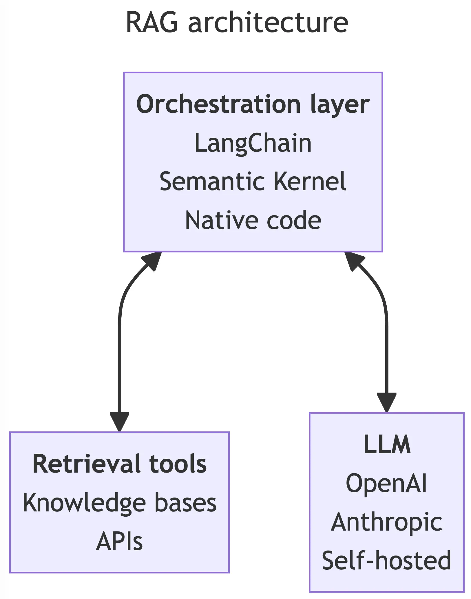
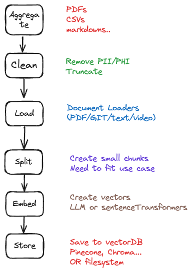
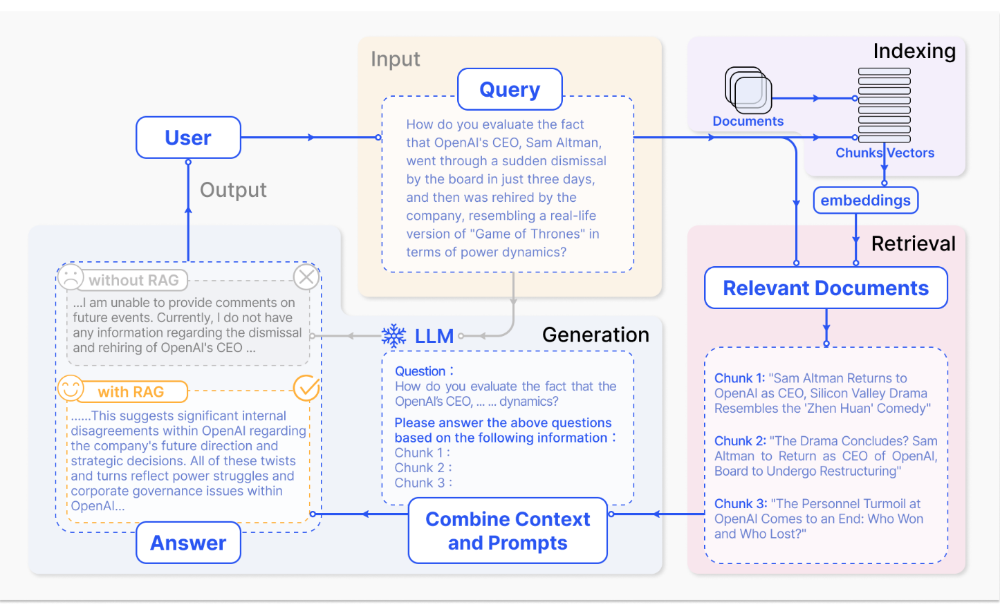
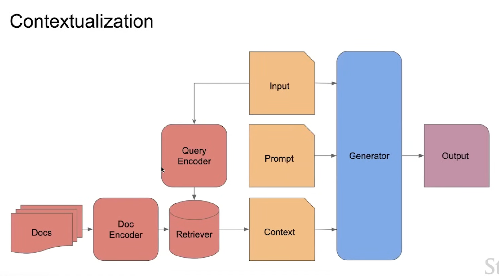
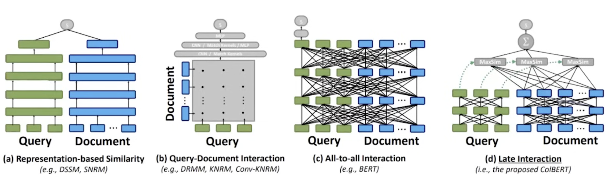

Source
1. [stackoverflow article](https://stackoverflow.blog/2023/10/18/retrieval-augmented-generation-keeping-llms-relevant-and-current/)
2. [RAG Paper](https://arxiv.org/abs/2005.11401)

## Basic Overview

tags: `rag`, `llm`, `retieval` `augumented` `generation`, `vectordb`, `langchain`, `openai`, `chatgpt`

Issues with using just LLM's -
1. Out of date
2. Hallucination if they don't know the answer

```python
from langchain.document_loaders import WebBaseLoader
from langchain.indexes import VectorstoreIndexCreator
loader = WebBaseLoader("https://www.promptingguide.ai/techniques/rag")
index = VectorstoreIndexCreator().from_loaders([loader])
index.query("What is RAG?")
```

### Basic Architecture


##### Orchestration Layer
It receives the user input and interacts with all the tooling, sends the prompt to LLM and retrieves the results.

Tools: LangChain, Semantic kernels, python code

##### Retrieval Tools
Ground the LLM to user prompt. It contains knowledge bases and API based retrieval systems

##### LLMs
The prompts are sent to this model

**Closed Models** (consumed using an API): Claude, OpenAI GPT4
**Open source**: Llama2, mistral, phi, gemma

Tools for open source models:
1. Ollama
2. Huggingface

### Knowledge Based Retrieval

VectorStore (not a requirement for RAG), they store vectors and support retrieval based on vector not exact match.

Raw Data --> VectorStore (ETL Pipeline)

#### ETL Pipeline

1. Aggregate Source Documents
2. Clean document content - anything such as PHI or PII that needs to be removed should be done here.
3. Load Documents using tools such as `unstructured`, `LlamaIndex`, `LangChain Document Loaders` - Loader might have caveats so read about them before using them.
4. Split: Split the content into chunks which can fit in prompt but also not lose meaning. If nothing works, you might need to write your own text splitter.
5. Create embedding for text chunks - numerical representation of one text's chunk's relative position and relationship to other chunks. Tools could be OpenAI embeddings, llamaindex or langChain might also have some. Also, things like `sentencetransformer` can be used.
6. Store - add the embeddings to vector store such as `PineCone`, `Weaviate`, `FAISS`, `Chroma` etc. or just store the vectors on filesystem.



Vector Store do allow updating if we need to add/remove source documents.
FineTuning on the other hand won't allow removing content.

Processing something like patient notes, might need an efficient way to create document indexing.


#### API Based Retrieval

The `orchestration layer` can also add context using an programmatic API endpoint.

### Prompting with [[RAG]]

The prompting might need - 

`Assistant Message`: Instruction to the chatbot
`History`: Maybe conversation history
`Context`: Find relevant chunks from `retrieval` tools, label different types of data sources if you have them
`User Prompt`: The question that the user wants to ask

The prompts might need cleaning to remove PII etc.

Use **tiktoken** to make sure you are not exceeding API limits.

## Improving Performance

- Garbage in, Garbage out - make sure the data is correctly captured e.g. excel headers are captured.
- Tune the split strategy - try with differently split vector stores
- Tune system prompt
- Filter Vector store results
- Try different embedding models or fine-tune your own model
	- https://huggingface.co/spaces/mteb/leaderboard

### Tool selection

##### Vector Databases
1. Filesystem
2. OpenAI Assistant
3. Milvus
4. Chroma
5. Pinecone
6. postgres
7. Mongodb

### Metrics

It can be non-trivial to measure the performance of a RAG pipeline as it consists of multiple steps. 
1. [RAGAS](https://docs.ragas.io/en/latest/concepts/metrics/index.html)
2. TruLens


### Learnings

##### First deployment
1. embedding model: text-embedding-large 3072 dimension (azure)
2. llm mode: GPT4 (azure)
3. Vector DB: milvus

I had to fix milvus `MilvusVectorStore(dim=3072, overwrite=True)` to match the embedding model. (is it the same dimension as the original GPT paper) 

***Model specifications** Our model largely follows the original transformer work [62]. We trained a 12-layer decoder-only transformer with masked self-attention heads (768 dimensional states and 12 attention heads). For the position-wise feed-forward networks, we used 3072 dimensional inner states.*

### Todos

1. How to retrieve relevant sections of test?

## CS 25 Lecture

LLM issues:
1. Hallucination
2. Attribution
3. staleness
	1. old data 
4. revisions
	1. remove information - patient removed conscent
5. customizations

Solution:
1. Couple to external memory

#### Contextualization



Paradigms
1. RAG is an open book setting.
2. Parametric, semi-parametric

### Architectures

Train:
Update the LM?
Query encoder
document encoder
update both? all?
pretrain from scratch?

Test:
system rather than model
	- multiple models
different or same index?

#### Frozen RAG
static - works because of incontext learning

#### Sparse Retrieval
TF-IDF
[[BM25]] - Best Match 25 

#### Dense Retriever
Not about specific word
OrQA (Lee et al 2019)
Dense Passage Retriever (DPR) - Karpukhin, Oguz 2020

MIPS: Max Inner Product Search

FAISS (Johnson el al 2019) : ANN algorithms
- faster search using centroids of vectors
ColBERT (Khattab et al. 2020): Named on [[Stephen Colbert]] shows
- Late interaction


#### SOTA

SPLADE: Sparse meet dense (Formal et al 2021)
DRAGON: Lin et al 2023 - <<- use this current off the shelf
Hybrid Search - might be the way to go

Nice Paper: RePlug Shi et al 2023 - uses perplexity and KL divergence 
In-Context RALM - also works well - Guu et al 

#### Contextualization of both retriever and generator

1. RAG (Lewis et al 2020)
	Generator and retriever are both updated. The paper says that frozen doesn't work very well.
2. FiD (Izacard and Grave 2020)
	 Better for larger number of documents.
3. kNN-LM (Khandelwal 2019)
	  Very simple idea and scales really well if you have huge retrieval corpus
	  Retro (Borgeaud et al 2022) - pretrain from scratch
4. Retro++ (Wang Ping Xu et al 2023) - in context RAG with retro

Why is there no retro open source - might not have been working very well?

### Contextualization All the way

##### REALM (Guu et al 2020)
The OG of non-frozen dense retrieval augmented LMs
Really visionary work
Downside: not really generative, BERT all the way

#### Atlas: Deep Dive
How to train the retriever?
- FiD style "attention distillation"
- EMDR
How to we pretrain?
- PrefixLM
- MLM
- Title to section generation
How do we update the retriever
- Query side only does work well
- reranker 
- full update both sides

Mistral works so much better because they are trained on large data and as they have sliding window attention so they don't need attend everything.

#### RAG vs Long Context

Attending of all over the long context for a specific question  is inefficient and the underlying architecture is using sparse attention which makes it similar to RAG

#### When to retrieve?

- FLARE "active retrieval augmentation"
- RAG-token, RAG-sequence, Retro-chunk

sometimes, i want to retrieve and sometimes i just want to generate - FLARE paper does this when training LLM to know when to retrieve and not

- TRIME (Zhong et al 2022) - how big is the index? 
- SILO (Min, Gururangan et al 2023) - isolating legal risk with a non-parametric data store
- Lost in the Middle (Liu et al 2023)
	- Retrieved contexts in the middle gets "lost"
- WebGPT Nakano et al 2021
- ToolFormer (Shick et al 2021)
- Self-RAG (Asai et al 2023)

#### Instruction Tuning

- IntructRetro (Wang et al 2023) / RA-DIT (Lin, Chen, Chen et al 2023)
#### Advanced Frozen RAG

- Child parent recursive retriever
- Hybrid search
- using zero-shot LLM
- hyDE:  Hypothetical Document Embedding (Gao, Ma, et al)

#### Future
- Joint from scratch pretraining is still unexplored
- What do scaling looks like?
- Rerankers work well and works better than vector databases -- so we might not need vector databases
- How do we measure the performance of RAG - currently we measure downstream performance
- Multimodal RAG (Gur et al 2021, Yasunga et al 2023)

#### RAG 2.0

- System over model
- Optimize it all the way - why not backprop into chunker?
- Trading off cost and quality
- Zero shot domain generalization
