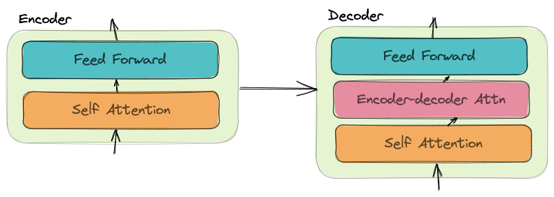
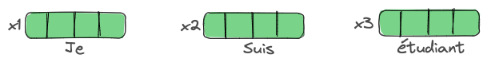
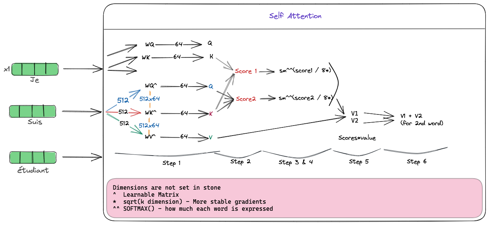
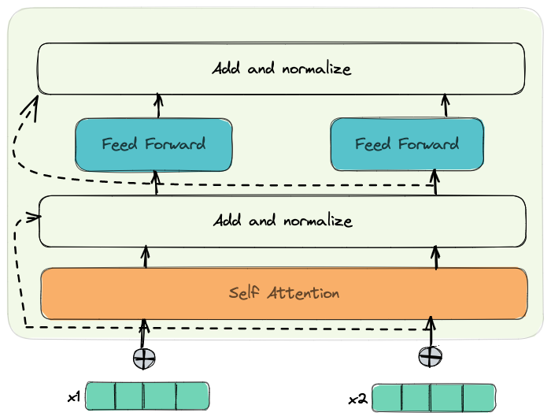

# Attention Is All You Need

url:: [Arxiv](https://arxiv.org/pdf/1706.03762.pdf)

### Summary

👉🏼 The key ideas in the `Attention is All You Need` paper is the introduction of not only self attention but multi-head attention along with positional encoding. 

On the decoder side, the nice idea is getting the Key and Value matrices from last stack of encoder and use them in the `encoder-decoder attention` layer.

Masked Multi-head attention on the decoder end to avoid self attention on future tokens.

After decoder layer output, we can apply `greedy decoding` or `beam search`

### Notes

#### Explanation by Jay Alamar

The encoder-decoder attention works similar to attention in Neural Machine Translation

### Steps

- All the words are converted to embeddings using an embedding algorithm (embedding length=512 in case of BERT)

- The same vector size e.g. 4 in this case * `max-seq-length` (*hyperparam*) is carried through encoder layers
- Each word has its own path through the encoder
- In self-attention layer, these paths depend on other (can't be parallel)
- Feed-forward part has no dependencies so it can be executed in parallel
- The same feed-forward part if applied to the output of self attention layers but the weights are different.

##### Self Attention

Intuition - Bake the understanding of other relevant words into the word currently getting processed

Steps 2-6 can be condensed into $$softmax{(\frac{Q K^T}{\sqrt{(d_k)}})}V = Z$$

##### Multi-head Attention

Intuition - in the above equation, Z contains a little of all encodings but could be dominated by itself.

In the `Attention is All You Need` paper, they have 8 attention heads, so we end up doing the same calculation as above 8 times with different weight matrices

Feedforward is expecting a single and not 8 matrix for each keyword. To achieve this,

- CONCAT all Z matrices
- Multiply with $W_0$ (8*$dim_{Z_{0....7}}$) matrix to get Z matrix for each word

##### Positional Embedding

To account for the order in the sequence of text, we assign a Positional Embedding vector to each input embedding.

These vectors follow a specific pattern.

##### The Residuals

These are the residual connections in the paper.

##### The Decoder

The set of K, V vectors from the encoder stack is used by each `encoder-decoder attention` layer of the decoder

In decoder, the self attention layer, is only allowed to attend to the positions before it in the output sequence. This is done by masking the future positions by `-inf` before softmax step

The  `encoder-decoder-attention` layer works like the `multihead attention layer` except, it creates its `Queries` matrix from layer below it and get the K, V matrices from the output of encoder.

###### Linear Layer

- Project the outputs of the decoder to a much larger vector called the `logits vector` (vocab wide)

##### Loss Function

The model outputs the probability distribution and this distribution is compared to the actual distribution using `Cross Entropy` or `Kullback-Leibler Divergence`

The output is always a vocab wide probability distribution of the expected token.

We can decode this by just taking the word with highest probability `Greedy decoding`

Or by keeping, lets say, two words, and run the model with keeping each word in the first place and so on. `beam search` [*Hyperparams*]